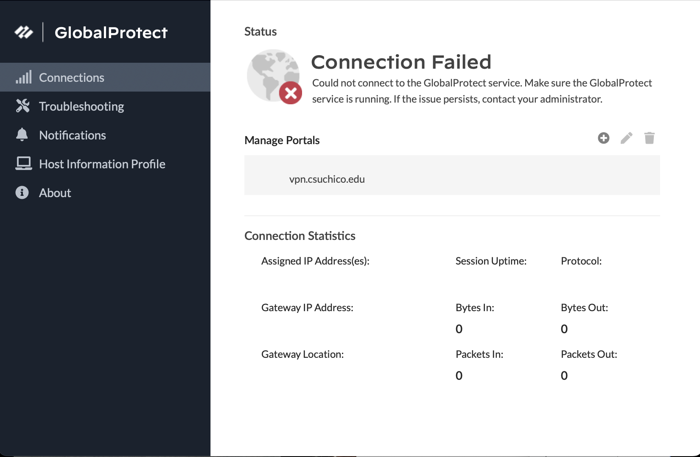
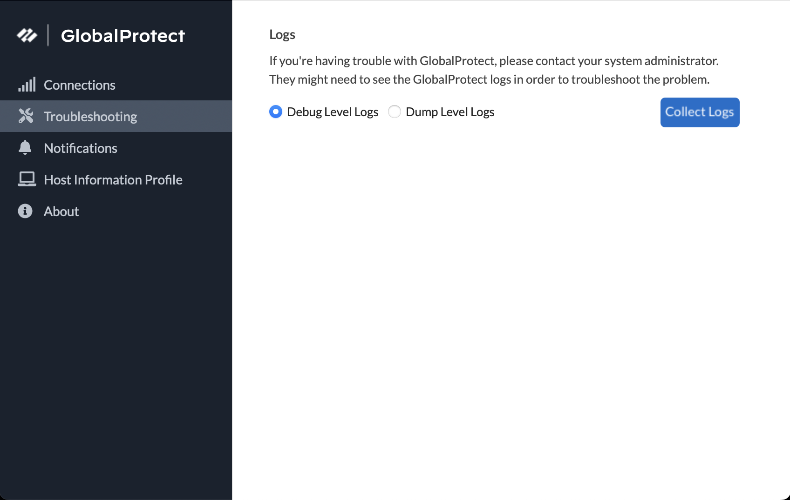

# Connecting to Global Protect(VPN)

Chico State has integrated the Palo Alto Global Protect OnDemand VPN in the last year or so. The benefit of Global Protect is that the network at Chico State is more secure due to the encryption of data between student devices and the network. However, the caveat is that you must have Global Protect on your device to access the network. 

I am currently taking a networks course and I need to access the ECC Linux server to do my next assignment. Without the VPN on, I can not access the server at all. 

On the Mac, Global Protect creates a widget on the menu bar that simply says connect. If everything goes well then it says ‘Connected’. If not then Global Protect gives up and tells the user to run to the IT guy. 

The widget is neat to have and is not overwhelming with extra information that isn’t necessary. It is **effective** in giving immediate user feedback. I can click the widget and check without having to open up the application.

However, problems arose when I could not connect to the VPN. The widget does not give me much troubleshooting information so I have to open the Global Protect settings.

The first step of my process of solving the issue is to make sure the portal address is not misspelled. Everything checked out fine for the portal address so I went to the Troubleshooting page. 

As helpful as I thought the troubleshooting page would be, this page directs you to download Debug logs on the local device. Only then to be assisted by an IT administrator to help fix Global Protect issues. As a user, I would not like to download logs as I have no use for debug logs. I believe the Global Protect page would be much better without this page and move it to Host Information. I think users would be quick to assume if they are having trouble with the device then what can they do to fix it?

A weakness I found with Global Protect is that there is no user feedback when failing. I’m not sure if it's failing because I am connected to a bad network or if my credentials are incorrect. Adding user feedback can help the user address the problems without creating an ITTS ticket. 

There are no other actions the user can do to fix any problems with Global Protect. This application is so minimal to the point where I wish there were more options to solve my VPN issue. 

I contacted ITSS and scheduled three different sessions to debug the issue. After each session was unsuccessful, they recommended me to backup and reinstall my OS. I found it ironic that ITTS couldn’t resolve Global Protect not working but my ITTS ticket says “resolved: recommended to reinstall OS”. 

Global Protect is not a User-Friendly experience. Students need to rely on ITSS documentation to download & configure this VPN.  I believe complications can arise when Global Protect is available through the Palo Alto Networks webpage, the Apple store, and the Chico State website. I was advised to only use the one from the ITSS site because the app store Global Protect and the Chico State download could use share dependency which can create conflict. This application can be more **error-tolerant** if there is a core Global protection application.

To this day I do not have a working VPN because I did not expect I would have to reinstall my OS for a possible resolution. I believe a solution for Global Protect is that it needs to add more user feedback when failing to connect.

